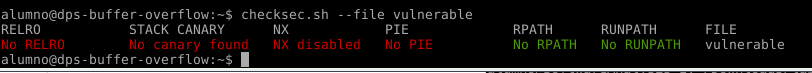
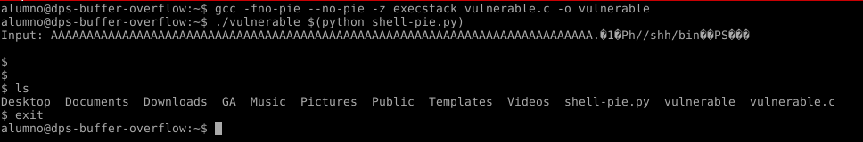

#Práctica de Buffer Overflow

En esta práctica, ejecuto un ejemplo muy básico sobre stack overflow utilizando funciones conocidas como vulnerables en C que nos permiten explotar esta vulnerabilidad.

Sistema utilizado (VM): Debian Jessie, arquitectura Intel i686 (32 bits)

Haciendo uso de strcpy, podemos aprovechar que dicha función no comprueba la longitud del string que va a copiar antes de hacerlo, facilitándonos la tarea de causar un desbordamiento de la pila.
En este caso nos desplazamos unos bytes más allá de la dirección de retorno (76 bytes), donde insertamos una shellcode ayudado de un script de Pyhton que imprime 76 "A"es seguido de la propia shellcode:

print "A" * 76 + "\x2e\x84\x04\x08\x31\xc0\x50\x68//sh\x68/bin\x89\xe3\x50\x53\x89\xe1\xb0\x0b\xcd\x80"

Una vez pasado por parámetro conseguimos la shell, consiguiendo realizar correctamente el desbordamiento de pila.

En este caso, se compila con la siguiente instrucción, deshabilitando todos los mecanismos de seguridad que protegen contra este tipo de ataque (aleatorización de direcciones de memoria, canarios, protección contra ejecución de código en secciones prohibidas, etc.):

gcc -fno-pie -no-pie -z execstack vulnerable.c -Wl,-z,norelro -o vulnerable

Con "checksec" instalado en el sistema (en este caso como script), podemos observar cómo hemos deshabilitado todas las seguridades (NX, ASLR, Canarios, RELRO) posibles para facilitar dicha explotación:

Aquí se muestra como se ejecuta el programa pasando como parámetro la shellcode padeada con "A"es, mostrando que dicho programa ejecuta la shellcode:
./vulnerable $(python shell-pie.py)
